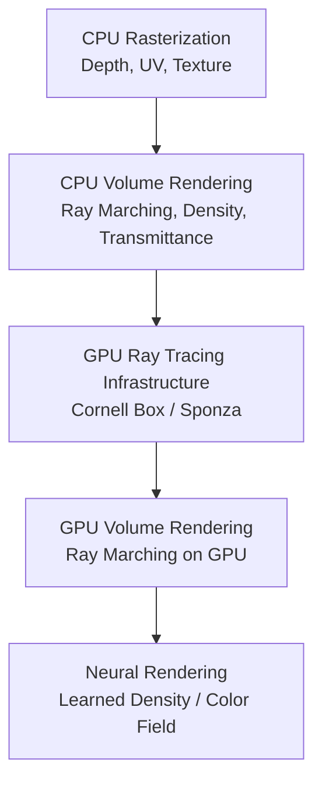
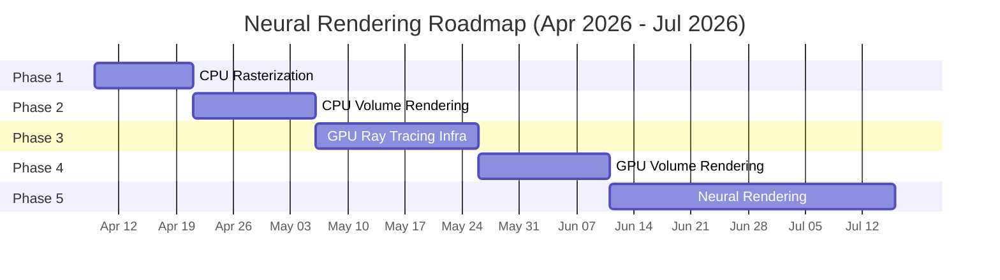
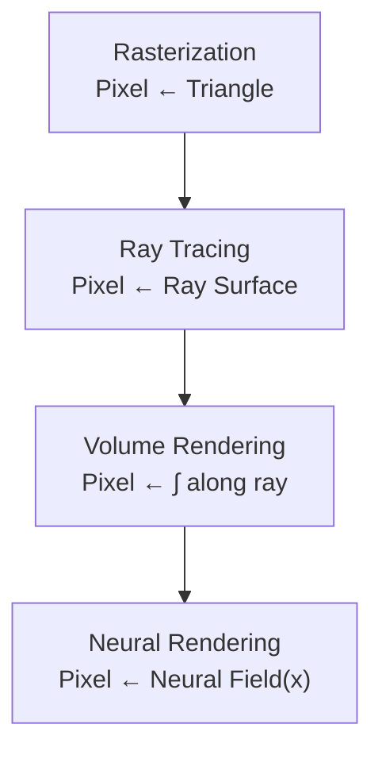

# Neural Rendering Roadmap (Apr → Jul 2026)

---

## 🧭 High-Level Roadmap

---

## 📅 Timeline

---

## 🧠 Concept Evolution

---

# 📦 Phase 1 — CPU Rasterization (Apr 9 – Apr 20)

### Goals

* [ ] Depth buffer
* [ ] Barycentric interpolation
* [ ] UV interpolation
* [ ] Texture mapping

---

## Daily Plan

| Date   | Task                                          | ✔   |
| ------ | --------------------------------------------- | --- |
| Apr 9  | Rasterizer refactor (modes, primitives, bbox) | [ ] |
| Apr 10 | Validate triangle fill + edge functions       | [ ] |
| Apr 11 | Implement depth buffer                        | [ ] |
| Apr 12 | Debug depth correctness                       | [ ] |
| Apr 13 | Add UV to vertex                              | [ ] |
| Apr 14 | UV interpolation                              | [ ] |
| Apr 15 | Texture sampling (nearest)                    | [ ] |
| Apr 16 | Load texture                                  | [ ] |
| Apr 17 | Apply to Cornell Box                          | [ ] |
| Apr 18 | Debug UV issues                               | [ ] |
| Apr 19 | Cleanup/refactor                              | [ ] |
| Apr 20 | Final validation (screenshots)                | [ ] |

---

# 📦 Phase 2 — CPU Volume Rendering (Apr 21 – May 5)

🔥 Critical phase (bridge to neural rendering)

### Goals

* [ ] Ray generation
* [ ] Ray marching
* [ ] Density field (σ)
* [ ] Transmittance
* [ ] Alpha compositing

---

## Daily Plan

| Date   | Task                         | ✔   |
| ------ | ---------------------------- | --- |
| Apr 21 | Camera → ray generation      | [ ] |
| Apr 22 | Ray marching loop            | [ ] |
| Apr 23 | Density function (sphere)    | [ ] |
| Apr 24 | Add color field              | [ ] |
| Apr 25 | Alpha accumulation           | [ ] |
| Apr 26 | Debug accumulation           | [ ] |
| Apr 27 | Cleanup                      | [ ] |
| Apr 28 | Improve sampling (step size) | [ ] |
| Apr 29 | Add transmittance            | [ ] |
| Apr 30 | Multiple density objects     | [ ] |
| May 1  | Camera movement              | [ ] |
| May 2  | Performance tuning           | [ ] |
| May 3  | Debug artifacts              | [ ] |
| May 4  | Final polish                 | [ ] |
| May 5  | Document learnings           | [ ] |

---

# 📦 Phase 3 — GPU Ray Tracing (May 6 – May 25)

### Goals

* [ ] GPU pipeline setup
* [ ] Ray tracing shader
* [ ] Scene loading (glTF)
* [ ] Acceleration structures
* [ ] Cornell Box render

---

## Weekly Breakdown

### Week 1

* GPU setup
* Ray generation shader
* Basic intersection

### Week 2

* Load Cornell Box
* Build acceleration structures
* Debug rendering

### Week 3

* Camera transforms
* Stable GPU render
* Cleanup

---

# 📦 Phase 4 — GPU Volume Rendering (May 26 – June 10)

### Goals

* [ ] Port ray marching to GPU
* [ ] Match CPU output
* [ ] Optimize

---

## Tasks

* Ray marching shader
* Density sampling
* Accumulation
* Debug visual artifacts

---

# 📦 Phase 5 — Neural Rendering (June 11 – July 15)

### Goals

* [ ] Understand NeRF pipeline
* [ ] Implement MLP
* [ ] Replace density function
* [ ] Train on simple scene
* [ ] Render novel views

---

## Weekly Breakdown

### Week 1–2

* Learn NeRF structure
* Implement neural field
* Integrate with ray sampling

### Week 3–4

* Training loop
* Debug convergence
* Render outputs

### Final Week

* Compare:

  * rasterization
  * ray tracing
  * volume rendering
  * neural rendering
* Write blog

---

# 📊 Progress Tracking

* Phase 1: ░░░░░░░░░░
* Phase 2: ░░░░░░░░░░
* Phase 3: ░░░░░░░░░░
* Phase 4: ░░░░░░░░░░
* Phase 5: ░░░░░░░░░░

---

# 📝 Daily Notes

## Apr 9

*

## Apr 10

*

---

# 🔑 Key Insights

* Volume rendering = accumulation along ray
* Neural rendering = learned density field
* Same rendering equation, different data source

---

# 🚀 Guiding Principle

> Build surfaces → understand rays → integrate along rays → replace function with neural network

